# Codex CLI Bus 架构与实现原理

本文档说明 Codex CLI Bus 的项目架构、运行模式、协议数据结构、核心流程和扩展点。当前实现是一个本地文件型总线，作为 Codex 插件通过 MCP Server 暴露工具，让用户可以用自然语言让一个 Codex CLI 启动、管理、委派任务给另一个 Codex CLI。

## 目标

Codex CLI Bus 解决的是本机多个 Codex CLI 之间的协作问题：

- 主 CLI 可以注册自己为 controller。
- 主 CLI 可以启动一个或多个子 CLI worker。
- 主 CLI 可以用自然语言向子 CLI 派发任务。
- 子 CLI 可以自动领取任务、执行 `codex exec`、把结果回传给主 CLI。
- 主 CLI 可以查看子 CLI 状态、任务、事件、日志。
- 多个主 CLI 可以各自拥有同名子 CLI，例如 `cli-a` 和 `cli-c` 都可以有自己的本地 `cli-b`。

## 总体架构

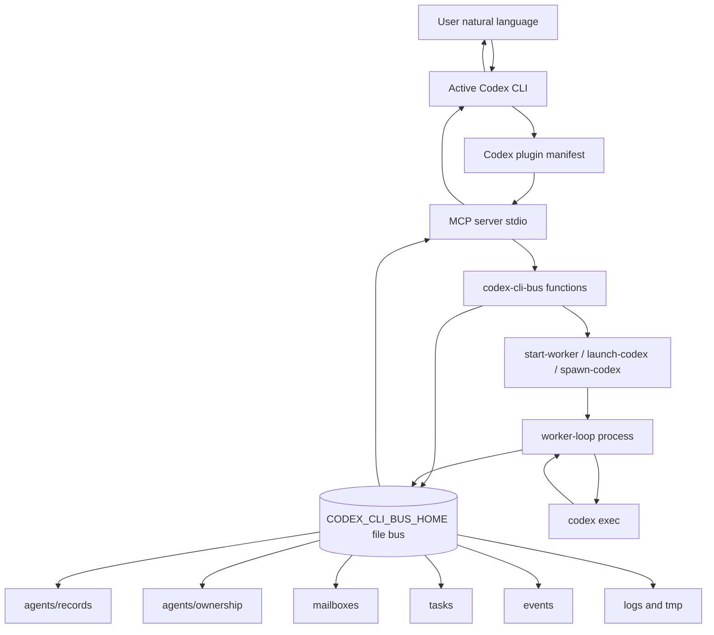

这个项目分成三层：

- 插件入口层：`.codex-plugin/plugin.json` 和 `.mcp.json` 让 Codex 识别插件并启动 MCP Server。
- MCP 工具层：`scripts/mcp-server.mjs` 把自然语言动作映射为结构化工具，例如 `start_worker_agent`、`send_task`、`list_tasks`。
- 总线协议层：`scripts/codex-cli-bus.mjs` 实现注册、发消息、领取消息、回信、启动 worker、状态查询、事件记录。

## 目录结构

```text
codex-cli-bus/
  .codex-plugin/
    plugin.json              # Codex 插件元信息
  .mcp.json                  # MCP server 启动配置
  README.md                  # 使用说明
  docs/
    ARCHITECTURE.md          # 本文档
  package.json               # 检查和测试脚本
  scripts/
    codex-cli-bus.mjs        # 核心协议、CLI、worker loop
    mcp-server.mjs           # MCP stdio server
    protocol.schema.json     # 协议 JSON schema
    codex-cli-bus.test.mjs   # 协议测试
  skills/
    cli-bus/
      SKILL.md               # Codex 加载插件后使用的协作规则
```

运行时数据默认写到 `~/.codex-cli-bus`，也可以通过 `CODEX_CLI_BUS_HOME` 指定：

```text
CODEX_CLI_BUS_HOME/
  agents/
    records/
      controller.json
      cli-a.cli-b.json
    ownership/
      cli-a/
        children.json
  mailboxes/
    cli-a/
      inbox/
      processing/
      archive/
    cli-a.cli-b/
      inbox/
      processing/
      archive/
  tasks/
    task_x.json
  events/
    events.jsonl
  logs/
  tmp/
```

## 插件与 MCP Server

`.codex-plugin/plugin.json` 声明这是一个 Codex 插件，并指向技能目录和 MCP 配置：

```text
plugin.json
  skills: ./skills/
  mcpServers: ./.mcp.json
```

`.mcp.json` 声明 Codex 应该用 Node 启动 `scripts/mcp-server.mjs`。MCP Server 启动后通过 stdio 和 Codex 通信。

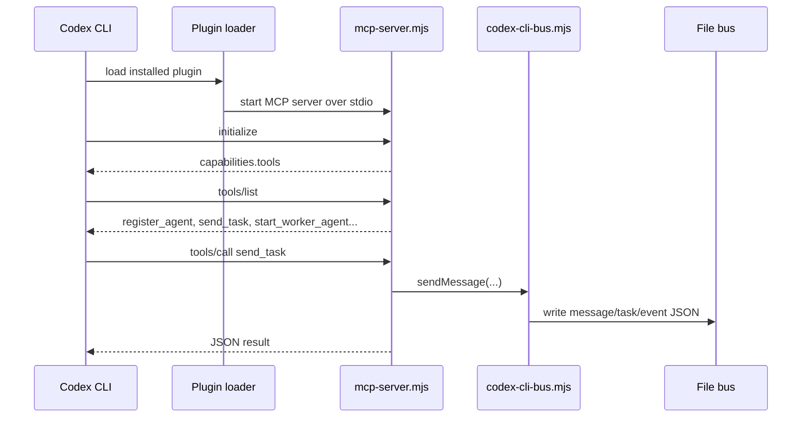

MCP tools 是自然语言入口，底层仍然调用同一份核心函数。脚本命令和 MCP tools 不维护两套协议，避免状态不一致。

## MCP 工具列表

| MCP tool | 底层能力 | 用途 |
| --- | --- | --- |
| `register_agent` | `registerAgent` | 注册当前或目标 CLI agent |
| `list_agents` | `readAgents` | 查看可见 agent 状态 |
| `get_agent_status` | `readAgents` + local name 解析 | 查看单个 agent |
| `send_task` | `sendMessage(type=task)` | 派发自然语言任务 |
| `send_message` | `sendMessage` | 发送普通消息、取消、状态请求 |
| `start_worker_agent` | `startWorker` | 启动常驻 worker loop |
| `launch_codex_agent` | `launchCodex` | 打开一个交互式 Codex CLI |
| `poll_messages` | `pollMessages` | 查看或领取 mailbox 消息 |
| `reply_message` | `replyToMessage` | 回复已领取消息 |
| `list_tasks` | `listTasks` | 查看任务记录 |
| `recent_events` | `readEvents` | 查看事件日志 |

## Agent 身份模型

当前设计区分全局 controller 和 owner-local child。

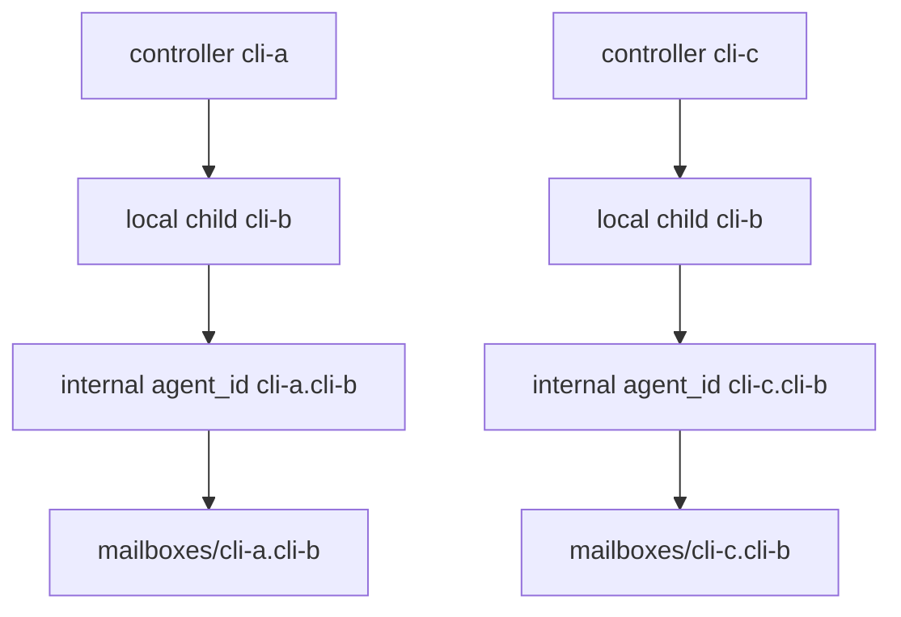

规则：

- 主 CLI / controller 的 `agent_id` 是全局名，例如 `cli-a`、`controller`。
- 子 CLI 的用户可见名是本地名，例如 `cli-b`。
- `cli-a` 启动本地 `cli-b` 时，内部真实 `agent_id` 是 `cli-a.cli-b`。
- `cli-c` 也可以启动本地 `cli-b`，内部真实 `agent_id` 是 `cli-c.cli-b`。
- 子 CLI 记录里同时保存：
  - `agent_id`: 内部真实 id，例如 `cli-a.cli-b`
  - `local_agent_id`: owner 内部本地名，例如 `cli-b`
  - `owner_agent_id`: 拥有者，例如 `cli-a`
  - `parent_agent_id`: 启动它的父 agent，通常等于 owner

`resolveAgentReference(root, agentId, ownerId, options)` 是核心解析函数。它把用户说的本地名解析为内部真实 id：

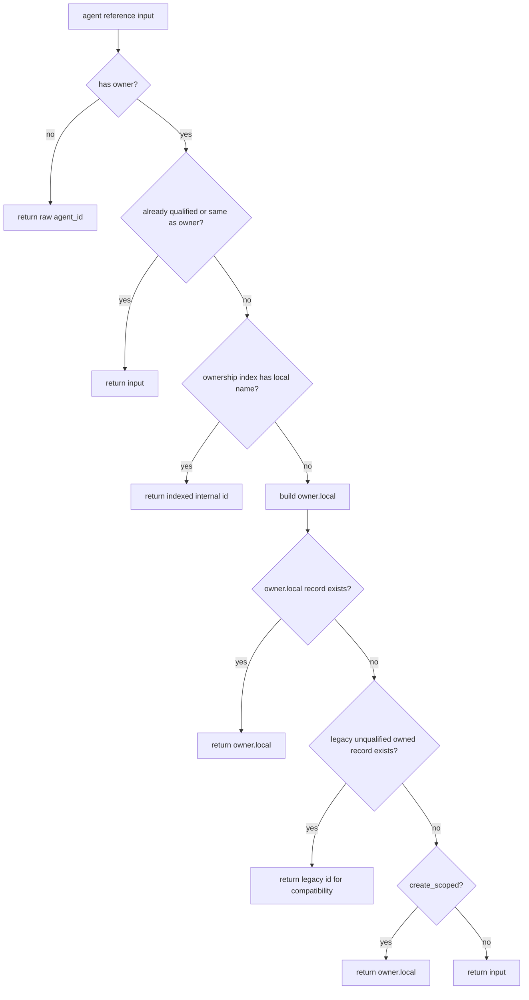

这让旧 `.bus` 里的未命名空间 agent 继续可用，同时新建 child 默认进入 owner-local namespace。

## 文件协议

### Agent Record

位置：

```text
agents/records/<agent_id>.json
```

关键字段：

```json
{
  "protocol_version": "1.0",
  "agent_id": "cli-a.cli-b",
  "local_agent_id": "cli-b",
  "session_id": "sess_x",
  "owner_agent_id": "cli-a",
  "parent_agent_id": "cli-a",
  "pid": 12345,
  "process": {
    "pid": 12345,
    "command": ["node", "...", "worker-loop"],
    "started_at": "2026-05-23T00:00:00.000Z",
    "exit_code": null
  },
  "workspace": "/path/to/workspace",
  "status": "idle",
  "current_task": null,
  "created_at": "2026-05-23T00:00:00.000Z",
  "last_seen_at": "2026-05-23T00:00:00.000Z",
  "metadata": {
    "mode": "worker-loop"
  }
}
```

### Ownership Index

位置：

```text
agents/ownership/<owner_agent_id>/children.json
```

示例：

```json
{
  "protocol_version": "1.0",
  "owner_agent_id": "cli-a",
  "child_agent_ids": ["cli-a.cli-b"],
  "child_local_agent_ids": ["cli-b"],
  "children": [
    {
      "agent_id": "cli-a.cli-b",
      "local_agent_id": "cli-b"
    }
  ],
  "updated_at": "2026-05-23T00:00:00.000Z"
}
```

这个 index 只存映射，不复制完整 agent record。完整记录只在 `agents/records/*.json`。

### Message

消息进入接收者 inbox：

```text
mailboxes/<agent_id>/inbox/<timestamp>-<message_id>.json
```

被领取后移动到：

```text
mailboxes/<agent_id>/processing/<timestamp>-<message_id>.json
```

完成后归档到：

```text
mailboxes/<agent_id>/archive/<message_id>.json
```

消息字段：

```json
{
  "protocol_version": "1.0",
  "id": "msg_x",
  "conversation_id": "conv_x",
  "parent_id": null,
  "task_id": "task_x",
  "from": "cli-a",
  "to": "cli-a.cli-b",
  "type": "task",
  "payload": {
    "text": "Run tests",
    "objective": "Run tests"
  },
  "created_at": "2026-05-23T00:00:00.000Z",
  "status": "queued",
  "delivery": {
    "state": "queued"
  }
}
```

### Task

任务记录在：

```text
tasks/<task_id>.json
```

任务用于跨 mailbox 汇总生命周期：

```json
{
  "protocol_version": "1.0",
  "task_id": "task_x",
  "conversation_id": "conv_x",
  "originator": "cli-a",
  "assignee": "cli-a.cli-b",
  "status": "queued",
  "objective": "Run tests",
  "message_id": "msg_x",
  "created_at": "2026-05-23T00:00:00.000Z",
  "updated_at": "2026-05-23T00:00:00.000Z"
}
```

### Event

事件追加到：

```text
events/events.jsonl
```

它是调试和状态总结的来源，例如：

- `agent_registered`
- `message_sent`
- `task_created`
- `message_claimed`
- `task_updated`
- `worker_task_started`
- `worker_task_finished`
- `agent_stopped`

## 核心流程

### 注册 Agent

注册通过 `registerAgent` 完成，CLI 命令是：

```bash
node scripts/codex-cli-bus.mjs register --agent cli-a --label controller
```

如果注册 child：

```bash
node scripts/codex-cli-bus.mjs register --agent cli-b --owner cli-a --parent cli-a
```

内部会写成 `cli-a.cli-b`。

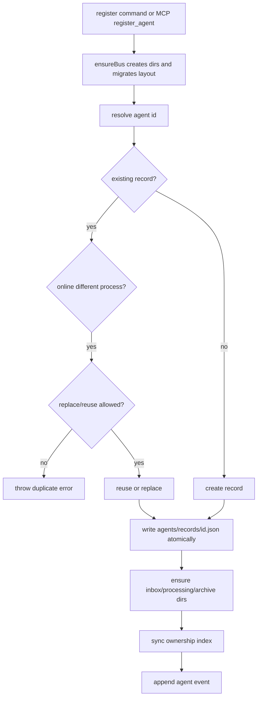

### 发送任务

当用户说“让 cli-b 跑测试”时，Codex 会调用 MCP tool `send_task`，底层执行 `sendMessage(type=task)`。

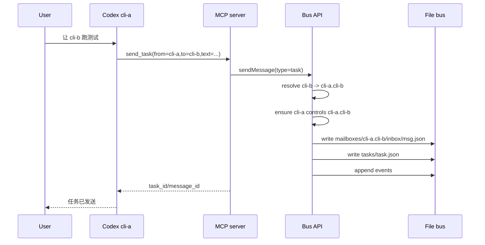

### Worker 自动领取和执行

`startWorker` 会启动一个后台 `worker-loop` 进程。`worker-loop` 周期性领取 task 类型消息，然后调用 `codex exec` 完成任务。

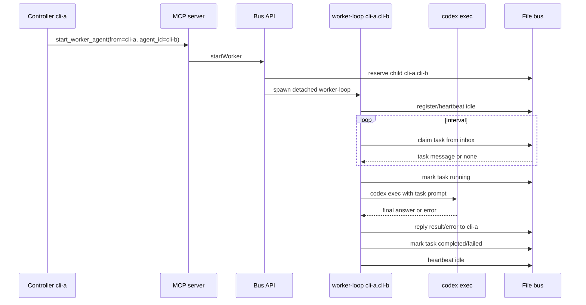

### 回复消息

`replyToMessage` 要求回复者必须是原消息的接收者。它会创建一条反向消息并更新任务状态。

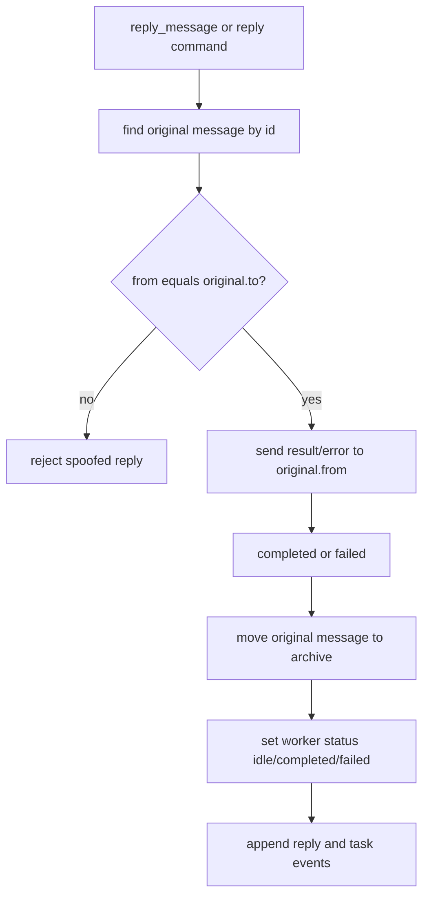

## Worker 启动模式

### `start-worker`

用于常驻自动领取任务。它适合“以后都让 cli-b 自动接任务”的场景。

特点：

- 默认复用同 owner 下已经在线的 worker。
- `--replace` 才会停止并替换在线 worker。
- 会拒绝隐式 fallback 名称，例如同 owner 已有 `eth-price-cli` 在线时，默认拒绝再开 `eth-price-cli-default`。
- 后台 daemon 的 stdout/stderr 写入 `logs/`。

### `launch-codex`

用于打开一个真实交互式 Codex CLI 终端，并把启动 prompt 写入临时文件。

特点：

- 适合用户想看见另一个 CLI 交互窗口的场景。
- 默认只处理初始任务，不是长期监听器。
- `--open-terminal` 会在 macOS Terminal 中启动。
- 不打开终端时会返回 `shell_command` 和脚本路径。

### `spawn-codex`

用于一次性非交互式 `codex exec`。

特点：

- 启动一个子进程执行一次任务。
- 使用 bootstrap prompt 指示它 poll 和 reply。
- 更适合脚本化调试，不是推荐的长期协作模式。

## 状态与生命周期

Agent 状态来自 record 字段、heartbeat 时间和进程存活检查。

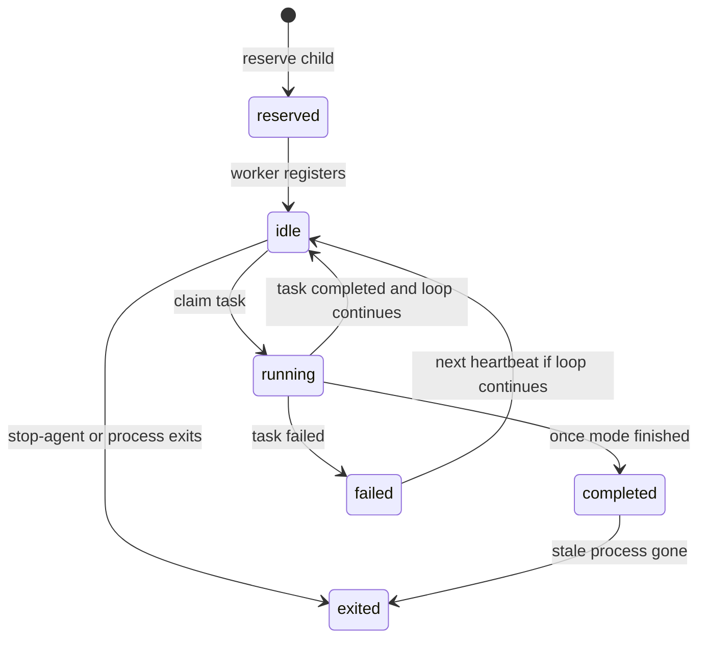

Task 生命周期：

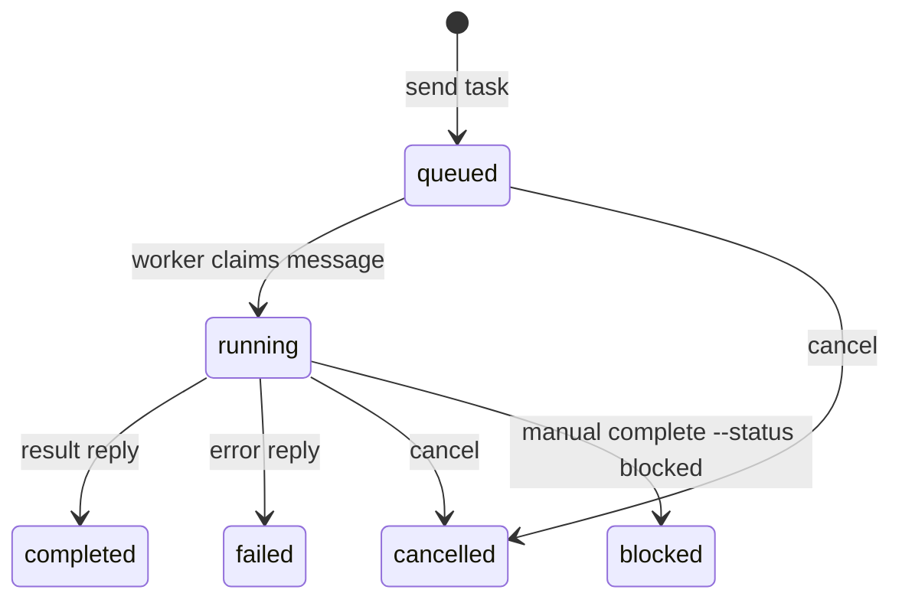

Message 生命周期：

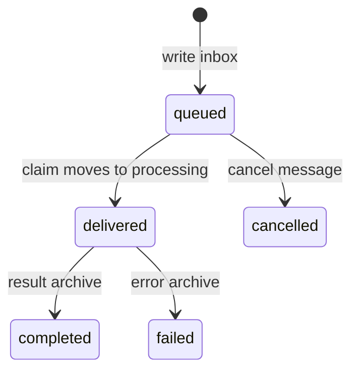

## 权限与隔离

隔离边界是 `owner_agent_id`。

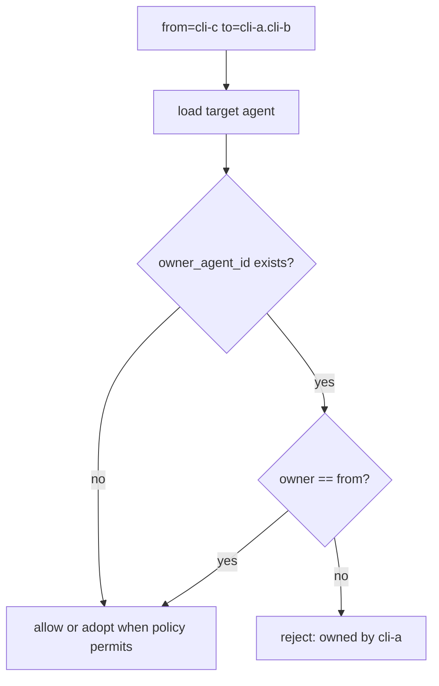

规则：

- Owner 可以查看和发送任务给自己的 child。
- 非 owner 不能操作另一个 owner 的 child 内部 id。
- Owner 可以 inspect child mailbox，但不能替 child claim；claim 必须由 agent 自己完成。
- Reply 必须由原始 message 的接收者发出，防止其他 agent 伪造结果。
- 多 controller 同名 child 通过 namespace 隔离，不共享 mailbox。

## 并发与一致性

当前实现是本地文件协议，不依赖数据库。

关键策略：

- JSON 写入使用临时文件加 rename，避免半写入 record。
- inbox 消息按文件名排序领取。
- claim 时把 inbox 文件移动到 processing。
- reply 后把 processing 消息归档到 archive。
- 任务状态单独写在 `tasks/*.json`，便于 controller 汇总。
- 事件日志是 append-only JSONL，便于排查。

当前没有实现跨机器分布式锁。它适合本机多个 Codex CLI 进程共享同一个 `CODEX_CLI_BUS_HOME`。如果放到网络盘使用，需要额外考虑文件锁、时钟和 rename 语义。

## MCP 审批与运行权限

MCP tool 是否需要审批由 Codex 宿主决定，不是 bus 协议自己决定。用户可以在 Codex 的审批界面选择：

- 本次允许
- 本 session 允许
- 未来总是允许
- 取消

Bus 插件本身仍遵守 Codex 当前 sandbox、approval、profile、model 等配置。MCP 层不会默认传 `model`，只有当用户明确指定模型并设置 `model_requested_by_user: true` 时才允许传递。

## 其他人如何使用

如果别人拿到这个项目，推荐以本地 marketplace 方式安装：

```bash
cd /path/to/Cli-demo
codex plugin marketplace add "$PWD"
codex plugin add codex-cli-bus@cli-demo
```

安装后重启 Codex CLI，让插件、技能和 MCP tools 重新加载。

如果要共享同一个 bus：

```bash
export CODEX_CLI_BUS_HOME="/path/to/shared/.bus"
```

如果不设置，默认使用各自的：

```text
~/.codex-cli-bus
```

## 扩展方式

### 新增一个 MCP Tool

流程：

1. 在 `scripts/codex-cli-bus.mjs` 中实现核心函数或复用已有函数。
2. 在 `scripts/mcp-server.mjs` 的 `tools` 数组中声明 tool schema。
3. 在 `callTool` switch 中把 MCP 参数转换为核心函数参数。
4. 在 `scripts/codex-cli-bus.test.mjs` 增加协议或 MCP 测试。
5. 更新 `skills/cli-bus/SKILL.md`，让 Codex 知道何时使用新 tool。

### 新增协议字段

流程：

1. 优先保持向后兼容，旧 record 缺字段时由读取路径补默认值。
2. 更新 `scripts/protocol.schema.json`。
3. 在 `migrateAgentLayout` 或相关 normalize 函数中补迁移逻辑。
4. 更新 README 和本文档。
5. 加测试覆盖旧数据和新数据。

## 设计边界

当前系统不是远程多用户调度平台，也不是消息队列服务。它的边界是：

- 本机文件总线。
- Codex CLI 插件和 MCP 工具入口。
- Agent 之间的轻量任务、状态和消息协作。
- Owner-local namespace 防止多主 CLI 同名 child 冲突。

如果未来要做成团队级服务，需要增加：

- 服务端存储或数据库。
- 鉴权和用户身份。
- 网络 API。
- 强一致 claim/lock。
- UI 或 dashboard。
- 更完善的任务重试、超时、取消和审计策略。
